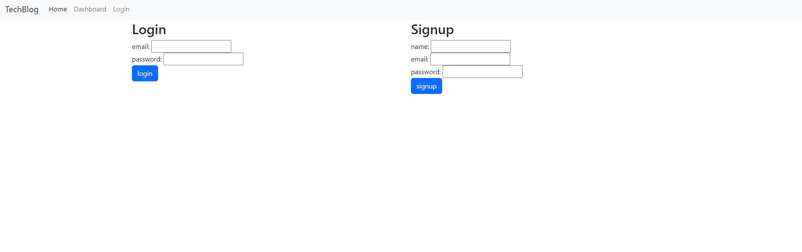
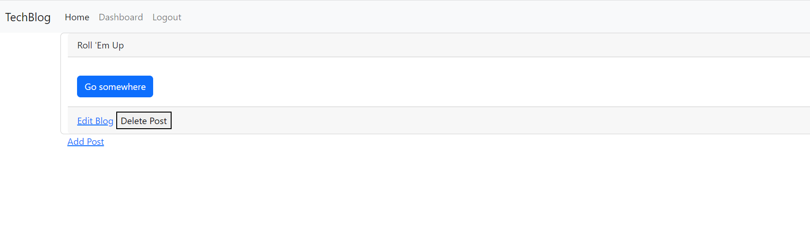
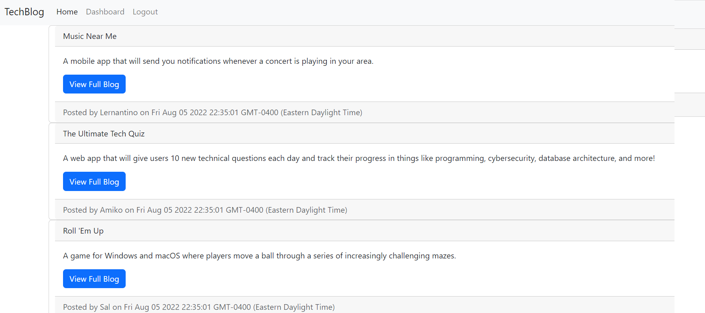

# Hw14-TechBlog

### This is Mikhail Sookwah's of creating a tech blog

This program includes: the

* A login page where you can login to your account or log-out

* A dashboard where you can post, edit and delete your blog

* You can even leave comments on the blog

----------------------------------------------------------------

[Link to the website](https://github.com/Mikhail25/Hw14-TechBlog)

[Link to the Heroku link](https://damp-inlet-54752.herokuapp.com)